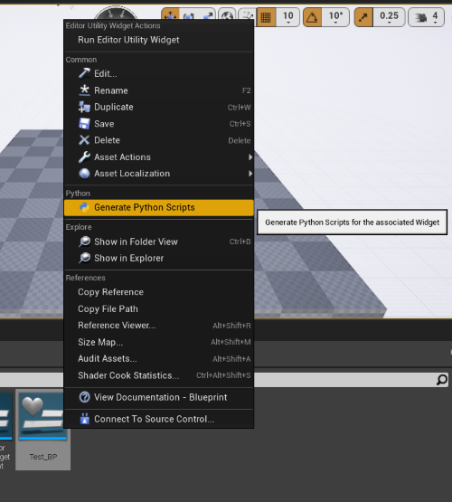

# Python Scripting for Editor Utility Widget
Making Editor Utility Widget scriptable by Unreal Python API, this plugin keep the UI design in Widget editor but all of its interaction logic can be written in Python. It's easier for programmer to script UI without using Blueprint.

## For Development
Select the Editor Utility Widget(s) and choose "Generate Python Scripts" from RMB clicked menu.

A dependencies folder and a folder named by the Widget asset name will be spawned in "{ProjectDir}/Content/Python" directory (the directory would be "{PluginDir}/Content/Python" if the Widget is located in a plugin module).

In the widget name folder, there are a XML file, which record the data from widget asset, and an example Python script. Developer can script the widget based on the example file.

## For Release
The plugin is mainly used to generate XML file and do not need to be inclued in release package. All the necessary widget data was extracted to that XML file and parsed by the Python dependency.

For your release package, only that Python dependency script and xml file need to be included with widget asset and your scripts.